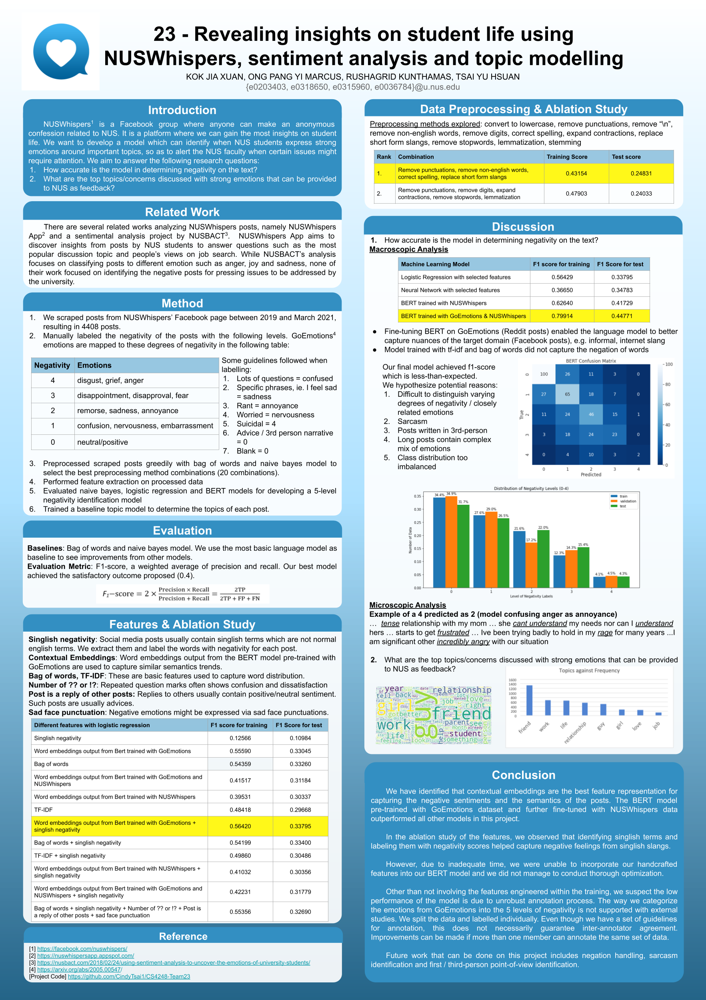

# CS4248-Team23
# Table of Contents
- [Code for each section within our project report](#code-for-each-section-within-our-project-report)
    - [3.1 Data Collection](#3.1-Data-Collection)
    - [EDA of dataset](#EDA-of-dataset)
    - [3.2 Data Preprocessing](#3.2-Data-Preprocessing)
    - [3.3 Feature Extraction](#3.3-Feature-Extraction)
    - [3.4 Model Training](#3.4-Model-Training)
    - [7.2 Topic modeling](#7.2-Topic-modeling)
- [Project poster](#Project-poster)
- [Requirement (Dependencies)](#Requirement-(Dependencies))

#### Instructions on how to use our code to perform sentiment analysis on NUSWhispers can be found from comments in CS4248-Team23/main.py 

## Code for each section within our project report

#### 3.1 Data Collection
* [CS4248-Team23/data/scraper.py](https://github.com/CindyTsai1/CS4248-Team23/blob/main/data/scraper.py)
* Dataset versions: [CS4248-Team23/data/v*.csv](https://github.com/CindyTsai1/CS4248-Team23/blob/main/data)

#### EDA of dataset
* [CS4248-Team23/EDA.ipynb](https://github.com/CindyTsai1/CS4248-Team23/blob/main/EDA.ipynb)

#### 3.2 Data Preprocessing

* Convert to lowercase
    * [CS4248-Team23/preprocessing/preprocessingFunctions.py](https://github.com/CindyTsai1/CS4248-Team23/blob/main/preprocessing/preprocessingFunctions.py)
* Remove “\n” in text
    * [CS4248-Team23/preprocessing/remove_newline.py](https://github.com/CindyTsai1/CS4248-Team23/blob/main/preprocessing/remove_newline.py)
* Remove digits
    * [CS4248-Team23/preprocessing/remove_digit.py](https://github.com/CindyTsai1/CS4248-Team23/blob/main/preprocessing/remove_digit.py)
* Expand contractions
    * [CS4248-Team23/preprocessing/expand_contraction.py](https://github.com/CindyTsai1/CS4248-Team23/blob/main/preprocessing/expand_contraction.py)
* Remove stopwords
    * [CS4248-Team23/preprocessing/preprocessingFunctions.py](https://github.com/CindyTsai1/CS4248-Team23/blob/main/preprocessing/preprocessingFunctions.py)
* Remove non-english words
    * [CS4248-Team23/preprocessing/remove_non_english.py](https://github.com/CindyTsai1/CS4248-Team23/blob/main/preprocessing/remove_non_english.py)
* Remove punctuations
    * [CS4248-Team23/main.py line 87](https://github.com/CindyTsai1/CS4248-Team23/blob/main/main.py#L87)
* Replace short-form slangs
    * [CS4248-Team23/preprocessing/expand_short_form_words.py](https://github.com/CindyTsai1/CS4248-Team23/blob/main/preprocessing/expand_short_form_words.py)
    * Scraped possible short form words: [CS4248-Team23/preprocessing/extract_short_form_slang.py](https://github.com/CindyTsai1/CS4248-Team23/blob/main/preprocessing/extract_short_form_slang.py)
        * Dictionary on short form and respective full form: [CS4248-Team23/preprocessing/slang.txt](https://github.com/CindyTsai1/CS4248-Team23/blob/main/preprocessing/slang.txt)
* Correct spelling
    * [CS4248-Team23/preprocessing/correct_spelling.py](https://github.com/CindyTsai1/CS4248-Team23/blob/main/preprocessing/correct_spelling.py)
* Lemmatization
    * [CS4248-Team23/preprocessing/lemmatization.py](https://github.com/CindyTsai1/CS4248-Team23/blob/main/preprocessing/lemmatization.py)

* **Processed dataset**
    * [CS4248-Team23/data/v6_{pre-processing method names}.csv](https://github.com/CindyTsai1/CS4248-Team23/blob/main/data)

#### 3.3 Feature Extraction
* Singlish negativity
    * Singlish negativity dictionary
        * Data clean of scraped Singlish terms
            * [CS4248-Team23/data/singlish_clean_up.py](https://github.com/CindyTsai1/CS4248-Team23/blob/main/data/singlish_clean_up.py)
        * Data extracted and labeled with negativity 
            * [CS4248-Team23/data/singlish_*+.csv](https://github.com/CindyTsai1/CS4248-Team23/blob/main/data)
    * Extract Singlish terms from each post and caculate corresponding negativity scores
        * [CS4248-Team23/features/singlish.py](https://github.com/CindyTsai1/CS4248-Team23/blob/main/features/singlish.py)
        * Data extracted: [CS4248-Team23/features/singlish_negativity.csv](https://github.com/CindyTsai1/CS4248-Team23/blob/main/features/singlish_negativity.csv)
* BERT embeddings
    * [CS4248-Team23/features/bert_embeddings.py](https://github.com/CindyTsai1/CS4248-Team23/blob/main/features/bert_embeddings.py)
    * Data extracted
        * Embeddings trained with GoEmotions and NUSWhispers: [CS4248-Team23/features/ge_nw_bert_embeddings.csv](https://github.com/CindyTsai1/CS4248-Team23/blob/main/features/ge_nw_bert_embeddings.csv)
        * Embeddings trained with GoEmotions: [CS4248-Team23/features/pt_bert_embeddings.csv](https://github.com/CindyTsai1/CS4248-Team23/blob/main/features/pt_bert_embeddings.csv)
        * Embeddings trained with NUSWhispers: [CS4248-Team23/features/nw_bert_embeddings.csv](https://github.com/CindyTsai1/CS4248-Team23/blob/main/features/nw_bert_embeddings.csv)
* BoW
    * [CS4248-Team23/features/bow.py](https://github.com/CindyTsai1/CS4248-Team23/blob/main/features/bow.py)
* Identify if a post is a reply post
    * [CS4248-Team23/features/is_not_reply.py](https://github.com/CindyTsai1/CS4248-Team23/blob/main/features/is_not_reply.py)
    * Data extracted: [CS4248-Team23/features/is_not_reply.csv](https://github.com/CindyTsai1/CS4248-Team23/blob/main/features/is_not_reply.csv)
* Identify the existence of sad face punctuation
    * [CS4248-Team23/features/is_sad_face.py](https://github.com/CindyTsai1/CS4248-Team23/blob/main/features/is_sad_face.py)
    * Data extracted: [CS4248-Team23/features/is_sad_face.csv](https://github.com/CindyTsai1/CS4248-Team23/blob/main/features/is_sad_face.csv)
* TF-IDF
    * [CS4248-Team23/features/ngram.py](https://github.com/CindyTsai1/CS4248-Team23/blob/main/features/ngram.py)
* Number of question marks
    * [CS4248-Team23/features/question_mark_count.py](https://github.com/CindyTsai1/CS4248-Team23/blob/main/features/question_mark_count.py)
    * Data extracted: [CS4248-Team23/features/question_mark_count.csv](https://github.com/CindyTsai1/CS4248-Team23/blob/main/features/question_mark_count.csv)

#### 3.4 Model Training
* BERT
    * [CS4248-Team23/bert_exploration/BERT_NUSWhispers.ipynb](https://github.com/CindyTsai1/CS4248-Team23/blob/main/bert_exploration/BERT_NUSWhispers.ipynb)
* Logistic regression
    * [CS4248-Team23/models/logistic_regression.py](https://github.com/CindyTsai1/CS4248-Team23/blob/main/models/logistic_regression.py)
* Neural Network
    * [CS4248-Team23/models/nn.py](https://github.com/CindyTsai1/CS4248-Team23/blob/main/models/nn.py)
* Evaluation metrics
    * [CS4248-Team23/main.py line 186-200](https://github.com/CindyTsai1/CS4248-Team23/blob/main/main.py#L186-L200)
#### 7.2 Topic modeling
* [CS4248-Team23/topic/topic_modeling.py](https://github.com/CindyTsai1/CS4248-Team23/blob/main/topic/topic_modeling.py)
* [CS4248-Team23/topic/topic_modeling.ipynb](https://github.com/CindyTsai1/CS4248-Team23/blob/main/topic/topic_modeling.ipynb)
* Topic modeling data
    * [CS4248-Team23/data/v10000000000.csv](https://github.com/CindyTsai1/CS4248-Team23/blob/main/data/v10000000000.csv)
* Topic modeling results
    * [CS4248-Team23/topic/topics.csv](https://github.com/CindyTsai1/CS4248-Team23/blob/main/topic/topics.csv)
    * [CS4248-Team23/topic/topics.xlsx](https://github.com/CindyTsai1/CS4248-Team23/blob/main/topic/topics.xlsx)
    * [CS4248-Team23/topic/lda.html](https://htmlpreview.github.io/?https://github.com/CindyTsai1/CS4248-Team23/blob/main/topic/lda.html)
    * [CS4248-Team23/topic/topic_details.png](https://github.com/CindyTsai1/CS4248-Team23/blob/main/topic/topic_details.png)
    * [CS4248-Team23/topic/wordcloud_final.png](https://github.com/CindyTsai1/CS4248-Team23/blob/main/topic/wordcloud_final.png)

## Project poster

## Requirement (Dependencies)
- numpy
- pandas
- scipy
- pycontractions
    - JAVA JDK 1.8 (Cannot run on newest version)
    - Download `GoogleNews-vectors-negative300.bin`
- sklearn
- imblearn
- spacy
- autocorrect
- nltk
- keras
- matplotlib.pyplot
- gensim
- wordcloud
- pyLDAvis
- operator
- transformers
- torch
- datasets
- glob
- seaborn
- IPython
- textblob
- collections
- glob
- plotly